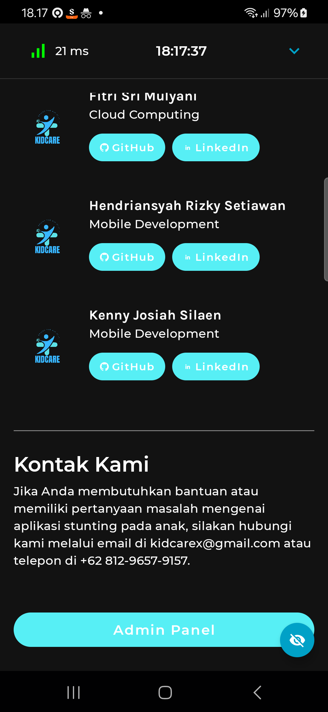

<h1 align="center">
  
<br>
KID CARE MOBILE DEVELOPMENT README
</h1>

# Team Profile

### Team ID : C242-PS019

### This is our Members

* (ML) M413B4KX3878 - Riska Dewi Yuliyanti - Sekolah Tinggi Teknologi Wastukancana
* (ML) M211B4KX0695 - Ashtri Cahyani - Universitas Indraprasta PGRI
* (ML) M312B4KX2146 - Kartika Rahma Sulistyawati - Universitas Sebelas Maret
* (CC) C413B4KY4123 - Shandy Satria Nugraha - Sekolah Tinggi Teknologi Wastukancana
* (CC) C764B4KX1539 - Fitri Sri Mulyani	- Sekolah Tinggi Teknologi Bandung
* (MD) A211B4KY1765 - Hendriansyah Rizky Setiawan - Universitas Indraprasta PGRI
* (MD) A211B4KY2173 - Kenny Josiah Silaen - Universitas Indraprasta PGRI

### Roles/personnel

* Project Plan ( M413B4KX3878 - Riska Dewi Yuliyanti, M211B4KX0695 - Ashtri Cahyani, M312B4KX2146 - Kartika Rahma Sulistyawati, C413B4KY4123 - Shandy Satria Nugraha, C764B4KX1539 - Fitri Sri Mulyani, A211B4KY1765 - Hendriansyah Rizky Setiawan, A211B4KY2173 - Kenny Josiah Silaen )
* UI/UX ( A211B4KY1765 - Hendriansyah Rizky Setiawan, A211B4KY2173 - Kenny Josiah Silaen, M413B4KX3878 - Riska Dewi Yuliyanti, C413B4KY4123 - Shandy Satria Nugraha )
* Build Machine Learning Model ( M312B4KX2146 - Kartika Rahma Sulistyawati, M413B4KX3878 - Riska Dewi Yuliyanti, M211B4KX0695 - Ashtri Cahyani )
* Android Apps Development ( A211B4KY1765 - Hendriansyah Rizky Setiawan, A211B4KY2173 - Kenny Josiah Silaen )
* Deployment Application ( C413B4KY4123 - Shandy Satria Nugraha, C764B4KX1539 - Fitri Sri Mulyani )

# KidCare Mobile Develoment Project
This MD project is our final project for Google Bangkit Academy 2024 Batch 2.

**Machine Learning:**
[KidCare Machine Learning Apps Developments](https://github.com/KidCare-Capstone-Project/ML_Structuring_Model)

**Cloud:**
[KidCare Cloud Service](https://github.com/KidCare-Capstone-Project/Cloud_computing)

**Project Background:**

Stunting is a condition of chronic malnutrition experienced by children, which results in impaired physical growth and brain development. Children who experience stunting will be shorter than children of the same age, and are at risk of learning difficulties and poor health in the future. The causes of stunting vary, ranging from lack of access to adequate nutrition, parental knowledge about nutrition, to less supportive sanitation and environmental conditions.

KID CARE is here as a digital solution that provides information, education, and monitoring features for parents and health workers. Through this application, users will get guidance and tools to monitor child growth in order to prevent stunting as early as possible. This team developed an application that prioritizes easy access to information and monitoring of child development to help reduce stunting rates in Indonesia.

**Android:**

The KID CARE application is developed with Android technology to provide wide access and ease of use for the community. This application uses Android as the main platform because of its wide reach in Indonesia. The KID CARE application will use various features from Android such as:

- Firebase Database and Firestore for safe and structured storage of children's health data.

- Androidx Compose and Material 3 for an intuitive and modern user interface, making the application more user-friendly.

- Kotlin Coroutines to improve application performance in managing data.

- Retrofit and OkHttp for reliable API integration in retrieving nutritional and health information data.

- Camera to allow users to upload photos to ai generative gemini to ask for specifications.

**Case:** In its implementation, the KID CARE application helps health workers and parents in overcoming stunting problems. For example, a mother in a remote area can use this application to monitor her child's weight and height development. Based on the inputted data, the application will provide a warning if there are indications of stunting in children and provide recommendations for appropriate diet and nutrition patterns.

The team will focus on developing and testing the following features: - Growth Monitoring and Analysis: Monitor children's height, weight, and head circumference regularly and compare them with existing data.

- Nutrition and Health Education: Provide educational content for parents about the importance of balanced nutrition and child health care.

- Notifications and Reminders: Provide reminders for routine health checks and vaccinations according to the child's age.

- Data Visualization: Displays child development graphs in an easy-to-understand way, making it easier to monitor.

- This application is expected to be an innovative solution that can help the government and society in reducing stunting rates and supporting the creation of a healthy and intelligent generation of Indonesia.

## Screenshots

**<div align="center">Splash Screen</div>**
<p align="center">
  
</p>

**<div align="center">onBoarding</div>**
<p align="center">
  
</p>

**<div align="center">Login Screen</div>**
<p align="center">
  
</p>

**<div align="center">Register Screen</div>**
<p align="center">
  
</p>

**<div align="center">Verification Code Screen</div>**
<p align="center">
  
</p>

**<div align="center">Home Screen</div>**
<p align="center">
  
</p>

**<div align="center">Orders Screen</div>**
<p align="center">
  
</p>

<p align="center">
  
</p>

**<div align="center">Profile Screen</div>**
<p align="center">
  
</p>

**<div align="center">My Account Screen</div>**
<p align="center">
  
</p>

**<div align="center">About Us Screen</div>**
<p align="center">
  
</p>

**<div align="center">Admin Panel Button Screen ( Admin Only Can See )</div>**
<p align="center">
  
</p>

**<div align="center">Admin Panel Screen ( Admin Only Can See )</div>**
<p align="center">
  
</p>

<p align="center">
  
</p>

**<div align="center">Detail Data Child Screen</div>**
<p align="center">
  
</p>

<p align="center">
  
</p>

<p align="center">
  
</p>

<p align="center">
  
</p>

**<div align="center">Predict Api Version Screen</div>**
<p align="center">
  
</p>

**<div align="center">Predict Model Ml Version Screen</div>**
<p align="center">
  
</p>

**<div align="center">Pregnant Mother Screen</div>**
<p align="center">
  
</p>

**<div align="center">Product Seller Screen</div>**
<p align="center">
  
</p>

**<div align="center">baby food recipe Screen</div>**
<p align="center">
  
</p>

**<div align="center">List Recomended Article Screen</div>**
<p align="center">
  
</p>

**<div align="center">List of articles Screen</div>**
<p align="center">
  
</p>

**<div align="center">Ai Generative By Gemini Screen</div>**
<p align="center">
  
</p>

<p align="center">
  
</p>

<p align="center">
  
</p>

**<div align="center">Youtube Screen</div>**
<p align="center">
  
</p>

**<div align="center">Detail Youtube Screen</div>**
<p align="center">
  
</p>

## Mockup

- SOON

## Development Roadmap
- [✓] [Kotlin](https://kotlinlang.org/)
- [✓] [Firebbase Database](https://firebase.google.com/docs/database/android/start)
- [✓] [Firebbase Firestore](https://firebase.google.com/docs/firestore)
- [✓] [Androidx Compose Bom](https://mvnrepository.com/artifact/androidx.compose/compose-bom)
- [✓] [Compose Material 3](https://developer.android.com/jetpack/androidx/releases/compose-material3)
- [✓] [Compose Material Icon](https://developer.android.com/reference/kotlin/androidx/compose/material/icons/package-summary)
- [✓] [Tool Preview Compose](https://developer.android.com/develop/ui/compose/tooling)
- [✓] [Coil Compose](https://coil-kt.github.io/coil/compose/)
- [✓] [Retrofit](https://square.github.io/retrofit/)
- [✓] [Play services Auth](https://developers.google.com/android/guides/setup)
- [✓] [OkHttp](https://square.github.io/okhttp/)
- [✓] [Generative Ai Gemini API](https://ai.google.dev/gemini-api/docs/get-started/tutorial?lang=android&hl=id)
- [✓] [JavaMail](https://javaee.github.io/javamail/Android)
- [✓] [Android Youtube Player](https://github.com/PierfrancescoSoffritti/android-youtube-player)
- [✓] [Navigation Component](https://developer.android.com/guide/navigation/navigation-getting-started)

## Features
- [✓] Splash Screen
- [✓] Login Option Google Or Email
- [✓] Login Email Screen
- [✓] Register Screen
- [✓] Forgot Password Screen
- [✓] Terms & Conditions Screen
- [✓] Verification Email Screen
- [✓] Dialog Message Error/Success, Welcome
- [✓] Destination Bar, Bottom Nav
- [✓] Home Screen
- [✓] Favorite Screen
- [✓] Profile Screen
- [✓] Can Logout From Profile
- [✓] Can See About Us in Profile
- [✓] Option Panel Generative AI & YouTube Health News For Kid Stunting
- [✓] Ping Signal Realtime & Realtime Clock Digital
- [✓] Enhanced Splash Screen
- [✓] Refined Banner Carousel Size on Home Screen
- [✓] Integrated Key Features on Home Screen (Prevention of Stunting, Stunting Management, Product Information, MPASI Recipes)
- [✓] Added Show/Hide Destination Bar Button
- [✓] Token Expiry Validation on Home Screen
- [✓] Improved UI for Add Child Profile Screen
- [✓] Transition from "Favorite" Section to "Orders" Section
- [✓] Created Tab Row for Order Management
- [✓] Enhanced Core Features: Online and Offline Prediction
- [✓] Improved UI for YouTube Health Section
- [✓] UI Enhancements for Adding Posters
- [✓] UI Enhancements for Adding Products and Brands
- [✓] Feature for Adding MPASI Recipes
- [✓] Feature for Adding Menu Recipes
- [✓] Feature for Managing Incoming Order Recipes
- [✓] Feature for Adding "Menu of the Day" and "Today’s Activities"
- [✓] Notification Reminder for Today’s Menu
- [✓] Interactive Child Photo Feature in Child Profile
- [✓] Verification Code Update from 6-Digit to 4-Digit and Email Display
- [✓] Local Data Storage for Offline Predictions
- [✓] Online Predictions

## Requirement
* Android Studio LadyBug
* Android Device or Android Emulator with minimum Lollipop Version
* Emulator / External Device
* USB Cable (to Connect Android Device to your Computer)

## Installation

### 1. Clone this Project to your Computer
```bash
git clone https://github.com/KidCare-Capstone-Project/MobileDev_Apps.git
```

or you can use Android Studio 

File > New > Project from Version Control ...

### 2. Open the Project in your Android Studio
Open Android Studio and select open an existing project.

### 3. Run Project in Android Studio
Wait for Gradle Build to Finish and finally press the `Run > Run ‘app’`. Now the app has been installed in your phone / emulator. Make sure that you have configured your android device or emulator 

## Thank You :)

